# 🧠 DocAI — Enterprise Document Intelligence Platform

> Upload any document. Ask anything. Get cited answers in seconds.

Built with FastAPI · Next.js · LangGraph · Qdrant · PostgreSQL · Redis · Docker

---


## System flowchart

The diagram below shows the complete request lifecycle — from the moment you log in to the moment a streamed answer appears in your browser.



> **Reading the diagram:**  
> Follow the arrows top to bottom. The left rail shows which phase you are in (Auth → Upload → Process → Retrieve → Answer). The dashed boxes group related steps. The feedback loop on the left of the agent shows what happens when confidence is low — the query is rewritten and retrieval runs again.

## What is this?

Most of us have been there — you need to find something in a 200-page PDF, or compare two quarterly reports, or pull out every deadline from a stack of contracts. You either read everything manually, or you Ctrl+F and hope for the best.

DocAI fixes that.

You upload your documents — PDFs, Word files, PowerPoints, spreadsheets, even scanned images — and then just ask questions in plain English. The platform reads everything, finds the most relevant parts, and gives you a precise answer with page-level citations so you know exactly where it came from.

It's not just a PDF chatbot. It's a full retrieval system with hybrid search, a cross-encoder reranker, and a LangGraph agent that decides the smartest way to answer each question.

---

## How it works — the full flow

```
┌─────────────────────────────────────────────────────────────────┐
│                         YOU (the user)                          │
│              Opens browser → logs in → uploads a file           │
└────────────────────────────┬────────────────────────────────────┘
                             │
                             ▼
┌─────────────────────────────────────────────────────────────────┐
│                      React Frontend                             │
│         Next.js · TypeScript · Zustand · Tailwind CSS           │
│                                                                 │
│  • Login / Register page                                        │
│  • Drag-and-drop document upload with live status polling       │
│  • Chat interface with streaming responses                      │
│  • Dashboard with usage analytics                               │
└────────────────────────────┬────────────────────────────────────┘
                             │  HTTP + SSE (streaming)
                             ▼
┌─────────────────────────────────────────────────────────────────┐
│                      FastAPI Backend                            │
│              Python · Pydantic · SQLAlchemy · JWT               │
│                                                                 │
│  POST /api/auth/login          → returns JWT token              │
│  POST /api/documents/upload    → saves file, queues processing  │
│  POST /api/chat/sessions/{id}/message → streams answer back     │
│  GET  /api/analytics           → dashboard stats                │
└──────────┬───────────────────────────────────┬──────────────────┘
           │                                   │
           ▼                                   ▼
┌──────────────────────┐           ┌───────────────────────────────┐
│   PostgreSQL         │           │   Celery Worker (Redis queue)  │
│                      │           │                               │
│  users               │           │  Picks up uploaded file and   │
│  documents           │           │  runs the full processing      │
│  chunks              │           │  pipeline in the background    │
│  chat_sessions       │           │                               │
│  messages            │           └──────────────┬────────────────┘
└──────────────────────┘                          │
                                                  ▼
┌─────────────────────────────────────────────────────────────────┐
│                   Document Processing Pipeline                  │
│                                                                 │
│  STEP 1 — Extract                                               │
│    PDF      → PyMuPDF reads text page by page                  │
│    Scanned  → EasyOCR converts image to text                   │
│    DOCX     → python-docx walks paragraphs and headings        │
│    PPTX     → python-pptx reads each slide                     │
│    XLSX/CSV → openpyxl extracts rows as structured text        │
│    Images   → EasyOCR runs directly on the file                │
│    Tables   → pdfplumber extracts tables, preserves structure  │
│                                                                 │
│  STEP 2 — Chunk                                                 │
│    Splits text into ~400-word pieces                           │
│    Splits on paragraph → sentence → word boundaries            │
│    (never arbitrary character counts)                          │
│    Adds 50-word overlap between chunks so context isn't lost   │
│    Never splits a table mid-row                                │
│                                                                 │
│  STEP 3 — Embed                                                 │
│    BGE-large-en-v1.5 converts each chunk → 1024 numbers        │
│    Similar meaning = similar numbers                           │
│    "Heart attack" and "cardiac arrest" end up near each other  │
│                                                                 │
│  STEP 4 — Store                                                 │
│    Qdrant   ← vectors (the 1024 numbers)                       │
│    PostgreSQL ← chunk text, page number, section heading       │
│    Document status updated to "ready"                          │
└─────────────────────────────────────────────────────────────────┘

When user asks a question:

┌─────────────────────────────────────────────────────────────────┐
│                    Hybrid Retrieval Engine                      │
│                                                                 │
│   Query: "What are the main risks mentioned?"                   │
│                          │                                      │
│            ┌─────────────┴─────────────┐                       │
│            ▼                           ▼                        │
│     Dense search                  BM25 search                  │
│   (semantic meaning)            (exact keywords)               │
│   finds "liability",            finds "risk", "hazard"         │
│   "exposure", "hazard"          wherever those exact           │
│   even without exact            words appear                   │
│   keyword match                                                 │
│            │                           │                        │
│            └─────────────┬─────────────┘                       │
│                          ▼                                      │
│                    RRF Fusion                                   │
│         Merges both lists by rank position                     │
│         (not raw scores — they're incomparable)                │
│                          │                                      │
│                          ▼                                      │
│               Cross-encoder reranker                           │
│       Reads query + each chunk together                        │
│       Much more accurate than embedding search                 │
│       Picks the best 5 from ~25 merged candidates             │
└──────────────────────────┬──────────────────────────────────────┘
                           │
                           ▼
┌─────────────────────────────────────────────────────────────────┐
│                      LangGraph Agent                            │
│                                                                 │
│   Node 1 — Router                                              │
│     Reads the question and classifies it:                      │
│     qa / compare / summarize / extract                         │
│                                                                 │
│   Node 2 — Retrieve                                            │
│     "compare" → retrieves from each doc separately            │
│     "summarize" → retrieves 10 chunks for full coverage       │
│     "qa" / "extract" → retrieves 5 best chunks                │
│                                                                 │
│   Node 3 — Generate                                            │
│     LLM reads the chunks and writes the answer                 │
│     Cites every fact with [Page X, Doc Y]                     │
│     Gives itself a confidence score                            │
│                                                                 │
│   Decision — done or refine?                                   │
│     confidence >= 0.3 → stream answer to user                 │
│     confidence < 0.3  → rewrite query, retrieve again         │
│     (max 2 retries to avoid infinite loops)                    │
└──────────────────────────┬──────────────────────────────────────┘
                           │
                           ▼
┌─────────────────────────────────────────────────────────────────┐
│                  Streaming Response (SSE)                       │
│                                                                 │
│   data: {"type": "intent",    "data": "qa"}                    │
│   data: {"type": "chunks",    "data": 5}                       │
│   data: {"type": "token",     "data": "The "}                  │
│   data: {"type": "token",     "data": "main risks are..."}     │
│   data: {"type": "citations", "data": [{page:12, doc:...}]}    │
│   data: {"type": "done",      "data": {"confidence": 0.91}}    │
│                                                                 │
│   Frontend renders each token as it arrives — no waiting       │
└─────────────────────────────────────────────────────────────────┘
```

---

## Features

### Document support
- **PDF** — text, scanned (OCR), tables, mixed
- **DOCX** — paragraphs, headings, embedded tables
- **PPTX** — slide-by-slide extraction
- **XLSX / CSV** — row-by-row structured data
- **TXT / MD** — plain text and markdown
- **Images** — PNG, JPG, WEBP, TIFF via OCR

### Retrieval
- Hybrid search: BM25 keyword + dense vector, fused with Reciprocal Rank Fusion
- Cross-encoder reranking — more accurate than bi-encoder alone
- Filter by specific documents or search all at once
- Multi-document comparison in a single query

### Agent
- Intent classification: Q&A, compare, summarize, extract
- Automatic query refinement when confidence is low
- Conversation memory — follow-up questions just work
- Citation-aware — every answer cites page + section + confidence score

### Infrastructure
- Background processing via Celery + Redis — uploads return instantly
- Streaming responses via Server-Sent Events
- JWT authentication — private documents per user
- One-command deployment with Docker Compose

---

## Tech stack

| Layer | Technology | Why |
|---|---|---|
| Frontend | Next.js 14, TypeScript, Zustand, Tailwind | Fast, typed, great DX |
| Backend | FastAPI, SQLAlchemy, Pydantic | Async Python, auto docs |
| Task queue | Celery + Redis | Non-blocking document processing |
| Vector DB | Qdrant | Filtered search, production-grade, fast |
| Metadata DB | PostgreSQL | Relational data, reliable |
| Embeddings | BAAI/bge-large-en-v1.5 | Top MTEB retrieval benchmark, open source |
| Reranker | BAAI/bge-reranker-v2-m3 | Cross-encoder, much more accurate than bi-encoder |
| LLM | Gemini 1.5 Flash / GPT-4o-mini | Config-driven, swap anytime |
| Agent | LangGraph | Multi-step reasoning, conditional edges |
| OCR | EasyOCR | Works offline, no API needed |
| PDF parsing | PyMuPDF + pdfplumber | Text + tables both handled |
| Deployment | Docker Compose + NGINX | One command to run everything |

---

## Project structure

```
docai/
│
├── backend/
│   ├── main.py                         # FastAPI app entry point
│   ├── config.py                       # All settings from .env
│   ├── celery_app.py                   # Background task worker
│   │
│   ├── api/routes/
│   │   ├── auth.py                     # Register, login, /me
│   │   ├── documents.py                # Upload, list, delete, status
│   │   ├── chat.py                     # Sessions, streaming messages
│   │   ├── analytics.py                # Dashboard stats
│   │   └── reports.py                  # Summary/quiz generation
│   │
│   ├── auth/
│   │   ├── service.py                  # Password hashing, JWT creation
│   │   ├── dependencies.py             # get_current_user FastAPI dep
│   │   └── schemas.py                  # Request/response models
│   │
│   ├── database/
│   │   ├── models.py                   # User, Document, Chunk, Message
│   │   └── connection.py               # Async engine, session factory
│   │
│   ├── services/
│   │   ├── document/
│   │   │   ├── extractors.py           # One extractor per file type
│   │   │   ├── chunker.py              # Semantic chunking with overlap
│   │   │   └── processor.py           # Orchestrates the full pipeline
│   │   │
│   │   ├── embedding/
│   │   │   └── embedder.py             # BGE-large async batch encoding
│   │   │
│   │   ├── retrieval/
│   │   │   ├── vector_store.py         # Qdrant wrapper
│   │   │   ├── bm25_retriever.py       # Keyword search
│   │   │   ├── reranker.py             # Cross-encoder reranking
│   │   │   ├── rrf.py                  # Reciprocal Rank Fusion
│   │   │   └── hybrid_retriever.py     # Orchestrates full retrieval
│   │   │
│   │   └── agent/
│   │       ├── state.py                # LangGraph state TypedDict
│   │       ├── prompts.py              # All LLM prompts in one file
│   │       ├── llm.py                  # Gemini / OpenAI factory
│   │       ├── nodes.py                # Router, retrieve, generate, refine
│   │       └── rag_agent.py            # Graph assembly + run/stream
│   │
│   └── utils/
│       ├── logger.py                   # Structured logging (structlog)
│       ├── exceptions.py               # Custom HTTP exceptions
│       └── file_utils.py               # Upload validation + saving
│
├── frontend/
│   └── src/
│       ├── pages/
│       │   ├── index.tsx               # Redirects to dashboard or login
│       │   ├── login.tsx               # Login + register (one page)
│       │   ├── dashboard.tsx           # Stats, chart, recent uploads
│       │   ├── documents.tsx           # Upload zone + document library
│       │   └── chat.tsx                # Sessions sidebar + chat UI
│       │
│       ├── components/
│       │   ├── layout/
│       │   │   ├── AppShell.tsx        # Auth guard + layout wrapper
│       │   │   ├── Sidebar.tsx         # Nav + recent sessions
│       │   │   └── Topbar.tsx          # Page title + user menu
│       │   ├── document/
│       │   │   ├── UploadZone.tsx      # Drag-and-drop with progress
│       │   │   └── DocumentCard.tsx    # Status badge + select checkbox
│       │   └── chat/
│       │       ├── ChatInterface.tsx   # Message bubbles + input
│       │       └── CitationsPanel.tsx  # Collapsible source citations
│       │
│       ├── store/
│       │   ├── authStore.ts            # Login, register, logout
│       │   ├── documentStore.ts        # Upload, delete, status polling
│       │   └── chatStore.ts            # Sessions, SSE streaming
│       │
│       └── utils/
│           └── api.ts                  # Axios with JWT interceptor
│
├── nginx/
│   └── nginx.conf                      # Reverse proxy + SSE config
│
├── docker-compose.yml                  # Full stack in one command
└── .env                                # Your API keys go here
```

---

## Getting started

### Prerequisites
- Docker + Docker Compose
- A Gemini API key (free) **or** an OpenAI API key

### 1. Clone the repo

```bash
git clone https://github.com/yourusername/docai.git
cd docai
```

### 2. Set up environment variables

```bash
cp backend/.env.example backend/.env
```

Open `backend/.env` and fill in at minimum:

```env
SECRET_KEY=pick-something-long-and-random
GOOGLE_API_KEY=your-gemini-key-here   # get one free at aistudio.google.com
```

### 3. Start everything

```bash
docker compose up -d
```

This starts: FastAPI · Celery worker · Next.js · PostgreSQL · Redis · Qdrant · NGINX

### 4. Open the app

```
http://localhost
```

Register an account, upload a document, wait for it to turn green, then start asking questions.

### Running without Docker (development)

```bash
# Terminal 1 — backend
cd backend
pip install -r requirements.txt
uvicorn main:app --reload

# Terminal 2 — celery worker
cd backend
celery -A celery_app worker --loglevel=info

# Terminal 3 — frontend
cd frontend
npm install
npm run dev
```

---

## Environment variables

| Variable | Required | Description |
|---|---|---|
| `SECRET_KEY` | Yes | JWT signing key — make it long and random |
| `GOOGLE_API_KEY` | One of these | Gemini 1.5 Flash — free tier available |
| `OPENAI_API_KEY` | One of these | GPT-4o-mini |
| `LLM_PROVIDER` | No | `gemini` or `openai` (default: gemini) |
| `DATABASE_URL` | No | Postgres connection string (default: local docker) |
| `REDIS_URL` | No | Redis connection string (default: local docker) |
| `QDRANT_URL` | No | Qdrant URL (default: local docker) |
| `EMBEDDING_MODEL` | No | Default: `BAAI/bge-large-en-v1.5` |
| `RERANKER_MODEL` | No | Default: `BAAI/bge-reranker-v2-m3` |
| `MAX_FILE_SIZE_MB` | No | Default: 50 |

---

## API reference

All endpoints require `Authorization: Bearer <token>` except auth routes.

Interactive docs available at `http://localhost:8000/api/docs`

```
POST   /api/auth/register                   Create account
POST   /api/auth/login                      Get JWT token
GET    /api/auth/me                         Current user info

POST   /api/documents/upload                Upload a file
GET    /api/documents                       List my documents
GET    /api/documents/{id}                  Document details
GET    /api/documents/{id}/status           Poll processing status
DELETE /api/documents/{id}                  Delete document + vectors

POST   /api/chat/sessions                   Create chat session
GET    /api/chat/sessions                   List sessions
POST   /api/chat/sessions/{id}/message      Send message (SSE stream)
GET    /api/chat/sessions/{id}/history      Get conversation history
PATCH  /api/chat/sessions/{id}              Rename session
DELETE /api/chat/sessions/{id}              Delete session

GET    /api/analytics                       Dashboard statistics
POST   /api/reports/summary                 Generate document summary
POST   /api/reports/quiz                    Generate quiz questions

GET    /health                              Health check
```

---

## Running tests

```bash
cd backend

# Unit tests (no external services needed)
pytest tests/unit/ -v

# Integration tests (requires Qdrant running)
pytest tests/integration/ -v

# All tests
pytest tests/ -v
```

---

## Design decisions — and why we made them

**Why Qdrant over Chroma?**
Qdrant supports payload filtering — we can restrict search to specific documents (`doc_id`) or specific users (`owner_id`) without post-filtering. Chroma requires loading all results then filtering in Python, which breaks at scale. Qdrant also has proper persistence, a production-ready HTTP API, and significantly better performance beyond a few thousand vectors.

**Why BM25 alongside vector search?**
Dense vector search is great at finding semantic matches — "What causes cardiac arrest?" will find chunks about "heart failure" even if those exact words don't appear. But it's poor at exact matches — searching for "GPT-4o" or a specific contract clause number might return semantically similar but wrong results. BM25 handles exact keyword matching reliably. Together they cover both cases; Reciprocal Rank Fusion merges the lists without needing to normalise incomparable scores.

**Why a cross-encoder reranker?**
Our embedding model (bi-encoder) encodes query and chunk independently, then compares the vectors. Fast — but the query and chunk never see each other during encoding, so nuance is lost. A cross-encoder reads "query + chunk" together, like a human would when deciding relevance. Much more accurate, but 10-20x slower. The solution: use the fast bi-encoder to get 20 candidates, then use the accurate cross-encoder to pick the best 5. Best of both.

**Why LangGraph over a simple chain?**
A plain RAG chain always does the same thing: retrieve → generate. LangGraph lets the agent decide what to do based on the question. "Compare these two reports" needs a different retrieval strategy than "summarize this document" or "what is the contract start date". The conditional edge (generate → refine → retrieve again) also means low-confidence answers automatically get a second attempt rather than confidently hallucinating.

**Why semantic chunking over fixed-size splits?**
Fixed 500-token chunks cut text at arbitrary points — mid-sentence, mid-argument. A chunk that ends with "the patient showed signs of" and a chunk that starts with "myocardial infarction" are both useless in isolation. Splitting on paragraph and sentence boundaries keeps semantic units together. The 50-word overlap ensures that context at chunk boundaries isn't lost.

**Why Celery + Redis for processing?**
Document processing takes 10-60 seconds depending on size and whether OCR runs. If we did this synchronously in the upload route, the user would stare at a spinner for a minute. Celery lets the upload route return in under a second with a doc_id, while the worker processes in the background. The frontend polls every 3 seconds to update the status badge from pending → processing → ready.

---